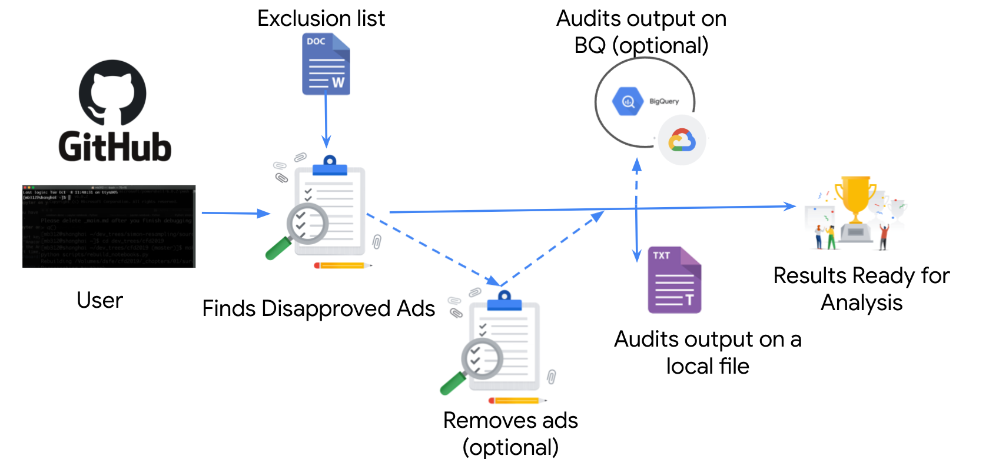

# Disapproved Ads Auditor - a scaled ad auditing tool

Advertisers operating at scale need a scalable solution to review policy violating ads across their accounts so they can ensure compliance with Google’s Ad Policies. As Google introduces more policies and enforcement mechanisms, advertisers need to continue checking their accounts to ensure they comply with Google’s Ads Policies.

The tool is used to review at scale all disapproved ads across advertisers’ accounts in order to allow advertisers to proactively audit their account at scale and take learnings from the results (how to reduce submission of ads potentially violating Google Ads Policies).

The tool is based on a Python script, which can be run in either of the following modes:

- “Audit Mode”- export an output of disapproved ads across your accounts
- “Remove Mode” - deletes disapproved ads and logs their details

# Project owners 
- nkal@google.com 
- cyogev@google.com
- dvirka@google.com
- Dev: eladb@google.com

## Disclaimer

**This is not an officially supported Google product.**
Copyright 2021 Google LLC. This solution, including any related sample code or data, is made available on an “as is,” “as available,” and “with all faults” basis, solely for illustrative purposes, and without warranty or representation of any kind. This solution is experimental, unsupported and provided solely for your convenience. Your use of it is subject to your agreements with Google, as applicable, and may constitute a beta feature as defined under those agreements.  To the extent that you make any data available to Google in connection with your use of the solution, you represent and warrant that you have all necessary and appropriate rights, consents and permissions to permit Google to use and process that data.  By using any portion of this solution, you acknowledge, assume and accept all risks, known and unknown, associated with its usage, including with respect to your deployment of any portion of this solution in your systems, or usage in connection with your business, if at all.


## Run modes
disapproved-ads-auditor tool is a python command-line tool that can run in one of the following modes:
* “Audit Only Mode”- export the relevant ads without deleting them;
* “Audit + Remove Mode” - export and delete the relevant ads.
There are a few output files (see here) which are saved locally under the “output” folder and optionally on BigQuery as well (“dissaproved_ads_auditor” dataset).





## Selecting the relevant policies

- This [json](https://github.com/google/disapproved-ads-auditor/blob/main/src/topics_substrings.json) contains two lists used by the disapproved-ads-auditor tool.
- Leave both lists empty if you want to audit ads labeled with all policy labels.
- Fill out the first list if you want to hand pick only relevant policies.
- Fill out the second list if you want to hand pick policies to be excluded from the audit.


```
Example A:
inclusion: [drugs, weapons] - any ad with a policy topic that contains any of the words "drugs" or "weapons" to be audited and / or removed.
exclusion: []

Example B:
inclusion: []
exclusion: [destination] - any ad which has only topics that contains the word "destination" should be skipped and not audited and / or removed.
```


## Getting the keys/tokens

- Python 3.9+
- Google Ads API Token (
  [apply for access to the AdWords API](https://developers.google.com/adwords/api/docs/guides/signup)).
- OAuth 2 Credentials(refer to
  [Generate OAuth2 credentials](https://developers.google.com/adwords/api/docs/guides/authentication#generate_oauth2_credentials)).
- [Enable Google ads API](https://developers.google.com/google-ads/api/docs/first-call/oauth-cloud-project#enable_the_in_your_project)
- Generate Refresh Token (refer to
  [Generate refresh token](https://developers.google.com/google-ads/api/docs/client-libs/python/oauth-desktop#step_3_-_generating_a_refresh_token))

## Setup

1. Using the tokens and keys from the above section, fill them in "src/secret_keys/google-ads.yaml" file

```shell
client_customer_id:
client_id:
client_secret:
developer_token:
login_customer_id:  # The MCC id 
refresh_token:
use_proto_plus: True
```

2. Install google ads API

```shell
pip3 install google-ads --upgrade
```


### steps 3-5 are optional: save audit to BQ in addition to local files
3. Install BigQuery API

```shell
pip3 install --user --upgrade google-cloud-bigquery
```

4. Create a GCP service-account (type: desktop-client) and download its key. See [GCP doc](https://cloud.google.com/docs/authentication/getting-started).
Give that service-account `bigquery.user` role (`BigQuery Job User`)

5. Set an environment variable:

```shell
export GOOGLE_APPLICATION_CREDENTIALS = <YOUR_SERVICE_ACCOUNT_KEY>
```


## Running

1. Run this while `<ACCOUNT_ID>` is the top MCC to run from.

```shell
python3 main.py -id <ACCOUNT_ID>
```

### How to fill `google-ads.yaml` \ `login_customer_id:` field
A. If `<ACCOUNT_ID>` is an MCC, it should appear in this field.
B. If `<ACCOUNT_ID>` is a single-account, its parent MCC should appear this field.


#### Flags
```shell
python3 main.py -id <ACCOUNT_ID> -rm
```
* `-rm`   | `--remove_ads`  - Audits and removes the ads.

##### Less common flags (if uploading to BQ)
* `-seq`  | `--sequential`   - Runs in sequential mode.
* `-bq`   | `--write_to_bq` - Audits in BQ in addition to local file.
* `-ddb`  | `--delete_db`   - Deletes the BQ tables which are relevant to the tool.
* `-clean_bq` | `--clean_outdated_bq`  -Deletes outdated rows in BQ.


#### Python reminder
- Redirect tool's output to file:
  ```shell
  python3 main.py > logFile
  ```

## Output schemas (CSV in local files / tables on BQ)

- Local result files, are under "output" folder.
- Under BQ dataset "disapproved-ads-auditor" (optional).


 ### "AllAccounts"
 lists all the subMCC and sub accounts that were scanned

[![all accounts][1]][1]

account_id
hierarchy: Mcc_SubMcc_SubAccount.
timestamp: when scanning all the sub accounts finished.
session_id: identifies the last run and join with other tables.


 ### "AdsToRemove" 
 list all the ads to be removed *including* all the data required for re-uploading the ads (if they were removed).

[![Ads to remove][4]][4]

 Based on [Google Ads ad_group_ad report](https://developers.google.com/google-ads/api/fields/v8/ad_group_ad#ad_group_ad.ad.final_urls)
- ad_id
- ad_type
- ad_group_id
- campaign_id
- hierarchy: Mcc_SubMcc_SubAccount.
- final_urls: The list of possible final URLs after all cross-domain redirects for the ad.
- policy_topics
- evidences
- mandatory_data
- timestamp: when the `audited_status` was set.
- audited_status: `SCANNED`, `REMOVED`, `FAILED_TO_REMOVE`. Another row is usually added for status change instead of being updated.
- account_id
- session_id: identifies the last run and join with other tables.
- removal_error: Google server error in case `audited_status = FAILED_TO_REMOVE`


 ### "PerAccountSummary" 
 when finished processing an account, it sums the numbers of ads to be removed, ads that have been removed.

[![per mcc summary][3]][3]

- account_id
- ads_to_remove_count: total # of ads to remove.
- timestamp: when scan for this account ended.
- session_id: identifies the last run and join with other tables.


 ### "PerMccSummary" 
 similar sums per top-MCC level


[![per account][2]][2]

- account_id
- total_sub_accounts: total # of sub accounts.
- top_mcc_total_ads_to_remove: total # of ads to remove.
- timestamp: when the scan for the whole mcc ended.
- session_id: identifies the last run and join with other tables.


 ## Example for relevant SQL queries (using session id for joinning fields)
[SQL query](src/sql/Report.sql)

 ## Notes and recommendations:
 * Run the code as a cron-job over the cloud.
 * Monitor that cron-job with mail alerts when it fails to run.
 * The code does 3 retries if it crashes.
 * Google BQ API allows a built-in retry mechanism (see [BQ query API](https://googleapis.dev/python/bigquery/latest/generated/google.cloud.bigquery.client.Client.html#google.cloud.bigquery.client.Client.query))


 ## Troubleshooting

1. 
```
ValueError: A required field in the configuration data was not found. The required fields are: ('developer_token',)
```
or
```
ValueError: The client library configuration is missing the required "use_proto_plus" key. Please set this option to either "True" or "False". For more information about this option see the Protobuf Messages guide: https://developer
s.google.com/google-ads/api/docs/client-libs/python/protobuf-messages
```

* Solution: Check you’ve filled the `google-ads.yaml` file correctly

2. 
```
Request with ID "XXXXX" failed with status "PERMISSION_DENIED" and includes the following errors:
        Error with message "User doesn't have permission to access customer. Note: If you're accessing a client customer, the manager's customer id must be set in the 'login-customer-id' header. See https://developers.google.com/goo
gle-ads/api/docs/concepts/call-structure#cid".
```

* Solution: make sure `login_customer_id :` in the yaml file contains the relevant `MCC id`.


## License
Apache Version 2.0
See [LICENSE](LICENSE)


  [1]: https://i.stack.imgur.com/9osCD.png
  [2]: https://i.stack.imgur.com/TdaxX.png
  [3]: https://i.stack.imgur.com/vHRrA.png
  [4]: https://i.stack.imgur.com/zistH.png
  [5]: https://i.stack.imgur.com/rZltv.png
  [6]: https://i.stack.imgur.com/Ip7EO.png
